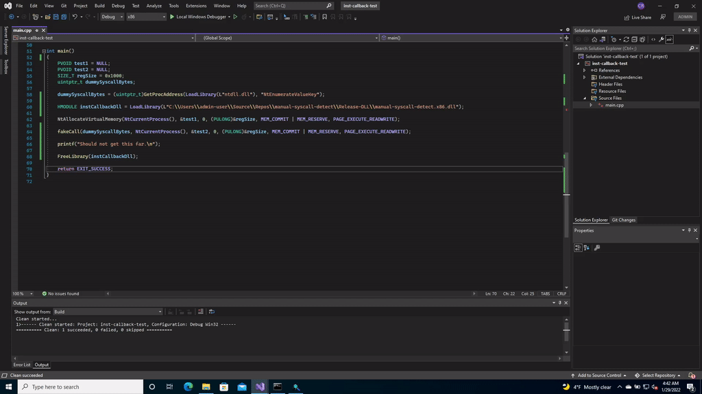

# manual-syscall-detect
A tool for detecting manual/direct syscalls in x86 and x64 processes using Nirvana Hooks.

## Description
A full write-up of this tool and how it works can be found on my blog [here](https://blog.xenoscr.net/2022/01/17/x86-Nirvana-Hooks.html).

## Introduction & Thanks
This is an implementation of Nirvana Hooks (a.k.a. Instrumentation Callbacks) that Alex Ionescu presented in 2015 at RECON, titled *Hooking Nirvana: Stealthy Instrumentation Hooks*. ([talk](https://www.youtube.com/watch?v=pHyWyH804xE), [slides](https://github.com/ionescu007/HookingNirvana/blob/master/Esoteric%20Hooks.pdf)) This code was built on Jack Ullrich's [syscall-detect](https://github.com/jackullrich/syscall-detect) project. For something that I was working on, I needed a version of this technique that worked in x86 processes. To fulfill that need, I wound up doing lots of research and reverse engineering of how Nirvana Hooks work in x86 processes that lead me to write an updated version that supported x86 applications. In the [sources](#sources) section, is a list of some of the blog posts, documentation, and projects that I learned from to write this tool. If anyone responsible for those resources are reading this, thanks for sharing!

## Functionality
This project can be compiled as an EXE or a DLL depending on your needs. The EXE is useful for demonstration purposes and testing. The DLL can be loaded into another process to provide telemetry for the process it has been injected into. To compile a specific version, select the appropriate option and build the solution:

- Debug - EXE
- Debug-DLL - DLL
- Release - EXE
- Release-DLL - DLL

This project makes use of [OutputDebugString](https://docs.microsoft.com/en-us/windows/win32/api/debugapi/nf-debugapi-outputdebugstringw) to provide telemetry. This was done to provide telemetry for applications that could not open a console. To view the telemetry from this tool, you will need to run the application in a debugger, write your own tool to view the debugging messages, or I suggest using [DebugViewe](https://docs.microsoft.com/en-us/sysinternals/downloads/debugview).

## Demonstration

# Sources
1. [https://outflank.nl/blog/2019/06/19/red-team-tactics-combining-direct-system-calls-and-srdi-to-bypass-av-edr/](https://outflank.nl/blog/2019/06/19/red-team-tactics-combining-direct-system-calls-and-srdi-to-bypass-av-edr/)
2. [https://github.com/jthuraisamy/SysWhispers](https://github.com/jthuraisamy/SysWhispers)
3. [https://github.com/vxunderground/VXUG-Papers/tree/main/Hells%20Gate](https://github.com/vxunderground/VXUG-Papers/tree/main/Hells%20Gate)
4. [https://github.com/j00ru/windows-syscalls](https://github.com/j00ru/windows-syscalls)
5. [https://gist.github.com/wbenny/b08ef73b35782a1f57069dff2327ee4d](https://gist.github.com/wbenny/b08ef73b35782a1f57069dff2327ee4d)
6. [https://github.com/nothydud/direct-syscall](https://github.com/nothydud/direct-syscall)
7. [https://raw.githubusercontent.com/darkspik3/Valhalla-ezines/master/Valhalla%20%231/articles/HEAVEN.TXT](https://raw.githubusercontent.com/darkspik3/Valhalla-ezines/master/Valhalla%20%231/articles/HEAVEN.TXT)
8. [https://github.com/jackullrich/syscall-detect](https://github.com/jackullrich/syscall-detect)
9. [https://www.youtube.com/watch?v=pHyWyH804xE](https://www.youtube.com/watch?v=pHyWyH804xE)
10. [https://github.com/ionescu007/HookingNirvana/blob/master/Esoteric%20Hooks.pdf](https://github.com/ionescu007/HookingNirvana/blob/master/Esoteric%20Hooks.pdf)
11. [https://github.com/ionescu007/HookingNirvana](https://github.com/ionescu007/HookingNirvana)
12. [https://secrary.com/Random/InstrumentationCallback/](https://secrary.com/Random/InstrumentationCallback/)
13. [https://splintercod3.blogspot.com/p/weaponizing-mapping-injection-with.html](https://splintercod3.blogspot.com/p/weaponizing-mapping-injection-with.html)
14. [https://gist.github.com/esoterix/df38008568c50d4f83123e3a90b62ebb](https://gist.github.com/esoterix/df38008568c50d4f83123e3a90b62ebb)
15. [https://www.codeproject.com/Articles/543542/Windows-x64-system-service-hooks-and-advanced-debu](https://www.codeproject.com/Articles/543542/Windows-x64-system-service-hooks-and-advanced-debu)
16. [https://web.archive.org/web/20160825133806/https://sww-it.ru/2016-04-11/1332](https://web.archive.org/web/20160825133806/https://sww-it.ru/2016-04-11/1332)
17. [https://web.archive.org/web/20160517025353/http://everdox.blogspot.ru/2013/02/instrumentationcallback-and-advanced.html](https://web.archive.org/web/20160517025353/http://everdox.blogspot.ru/2013/02/instrumentationcallback-and-advanced.html)
18. [https://github.com/ec-d/instrumentation-callback-x86](https://github.com/ec-d/instrumentation-callback-x86)
19. [https://wbenny.github.io/2018/11/04/wow64-internals.html](https://wbenny.github.io/2018/11/04/wow64-internals.html)
20. [http://blog.rewolf.pl/blog/?p=621](http://blog.rewolf.pl/blog/?p=621)
21. [https://docs.microsoft.com/en-us/windows/win32/sysinfo/image-file-machine-constants](https://docs.microsoft.com/en-us/windows/win32/sysinfo/image-file-machine-constants)
22. [https://github.com/x64dbg/ScyllaHide](https://github.com/x64dbg/ScyllaHide)
22. [https://docs.microsoft.com/en-us/sysinternals/downloads/debugview](https://docs.microsoft.com/en-us/sysinternals/downloads/debugview)
